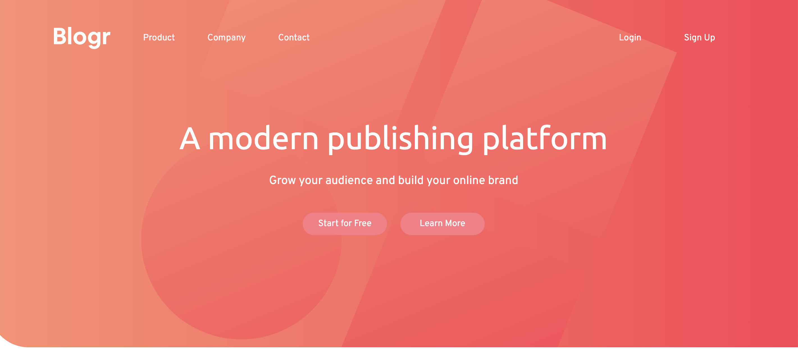

# Frontend Mentor - Blogr landing page solution

This is a solution to the [Blogr landing page challenge on Frontend Mentor](https://www.frontendmentor.io/challenges/blogr-landing-page-EX2RLAApP). Frontend Mentor challenges help you improve your coding skills by building realistic projects. 

## Table of contents

- [Overview](#overview)
  - [The challenge](#the-challenge)
  - [Screenshot](#screenshot)
  - [Links](#links)
  
- [My process](#my-process)
  - [Built with](#built-with)
  - [What I learned](#what-i-learned)
  - [Continued development](#continued-development)

## Overview

### The challenge

Users should be able to:

- View the optimal layout for the site depending on their device's screen size
- See hover states for all interactive elements on the page

### Screenshot

### Links

- Solution URL: [Add solution URL here](https://stefanseliger.github.io/Blogr_landing_Frontend_Mentor/)

## My process

### Built with

- Semantic HTML5 markup
- SASS/SCSS custom properties
- Flexbox
- CSS Grid

### What I learned

I worked a lot with Grid and Flexbox to adjust the positions of elements. I also improved my knowledge how to integrate background images more nicely and to build media queries. 

### Continued development

I still want to improve my skills building respronsive nav bars and how to implement drop down menus more nicely. 

